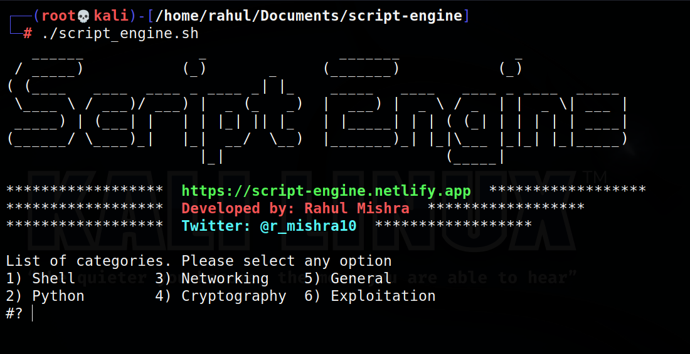
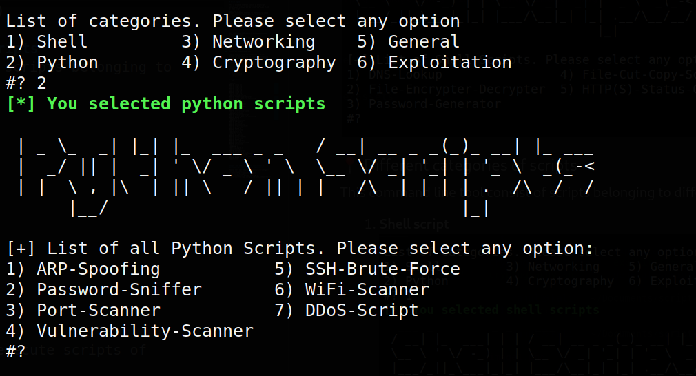
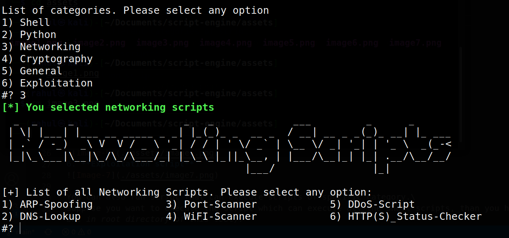
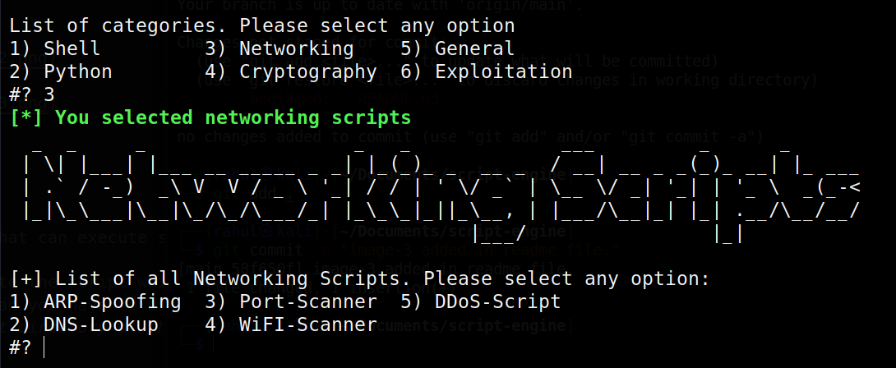
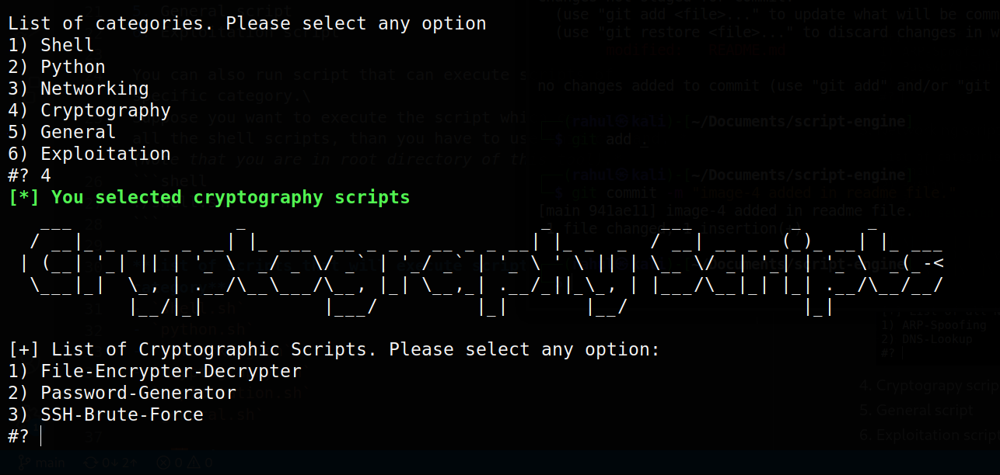
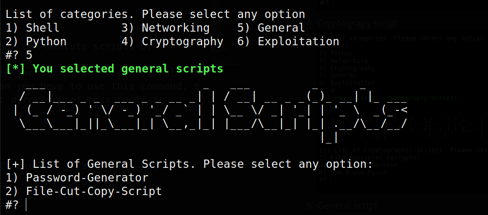
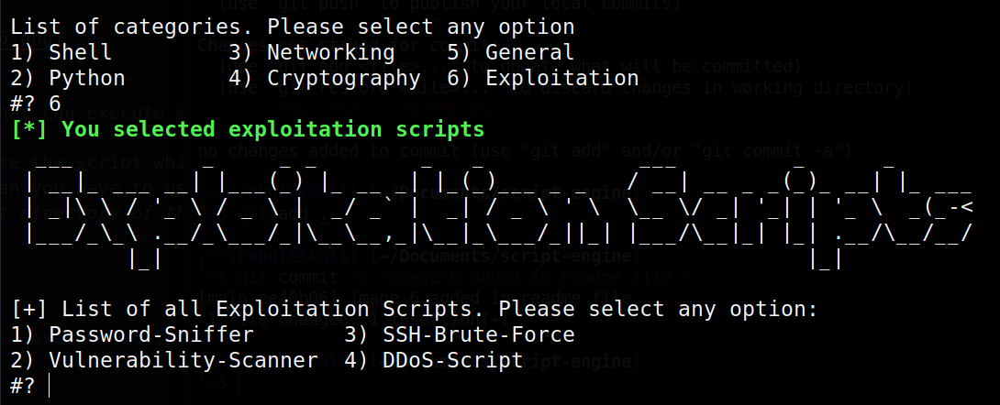

# Script Engine

This is a command line tool, consist of many scripts related to different categories. These scripts can be used for different purposes. All the scripts are python scripts or shell script.

### 🚀 How to use
*To use this command line tool run the following command after cloning the repository to your local machine*
```shell 
./script_engine.sh
```
***Note:*** *If you want to contribute in this project, then please first read the [Contribution Guidelines](https://github.com/rahulMishra05/script-engine/blob/main/contribution.md).\
I will be happy if you give some times to this project and contribute, to make this tool better and optimized.*



### 📍 Different categories of scripts
This command line tool consist of scripts belonging to different ctegories.
1. **Shell script**

2. **Python script**

3. **Networking script**

4. **Cryptograpy script**

5. **General script**

6. **Exploitation script**


You can also run script that can execute scripts of specific category.\
Suppose you want to execute the script which can execute all the shell scripts, than you have to use this command. *(Note that you are in root directory of this tool).* 
```shell
./shell.sh
```

**List of scripts that will execute scripts of a specific category**
- `shell.sh`
- `python.sh`
- `networking.sh`
- `cryptography.sh`
- `exploitation.sh`
- `general.sh`

### 🧱 Directory Tree
```bash
.
├── assets
│   ├── image1.png
│   ├── image2.png
│   ├── image3.png
│   ├── image4.png
│   ├── image5.png
│   ├── image6.png
│   └── image7.png
├── contribution.md
├── cryptography-scripts
│   ├── file-encrypter-decrypter
│   ├── password-generator-shell-script
│   ├── README.md
│   └── ssh-brute-force
├── cryptography.sh
├── exploitation-scripts
│   ├── DDoS-Script
│   ├── password-sniffer
│   ├── README.md
│   ├── ssh-brute-force
│   └── vulnerability-scanner
├── exploitation.sh
├── general-scripts
│   ├── file-cut-copy-script
│   ├── password-generator-shell-script
│   └── README.md
├── general.sh
├── networking-scripts
│   ├── ARP-spoofing
│   ├── DDoS-Script
│   ├── dns-lookup-host
│   ├── http-status-checker
│   ├── port-scanner
│   ├── README.md
│   └── wifi-scanner
├── networking.sh
├── python-scripts
│   ├── ARP-spoofing
│   ├── DDoS-Script
│   ├── password-sniffer
│   ├── port-scanner
│   ├── README.md
│   ├── ssh-brute-force
│   ├── vulnerability-scanner
│   └── wifi-scanner
├── python.sh
├── README.md
├── script_engine.sh
├── shell-scripts
│   ├── dns-lookup-host
│   ├── file-cut-copy-script
│   ├── file-encrypter-decrypter
│   ├── http-status-checker
│   ├── password-generator-shell-script
│   └── README.md
└── shell.sh


```

***Note :-*** **This command line tool is still in development, and fell free to give suggestions.**

You can share your thoughts with me on [twitter](https://twitter.com/r_mishra10),
[linkedIn](https://www.linkedin.com/in/rahul-mishra-66210b185),
[telegram](https://t.me/rahul_mishra10) or
[instagram](https://www.instagram.com/rahul_mishra10/?hl=en)
