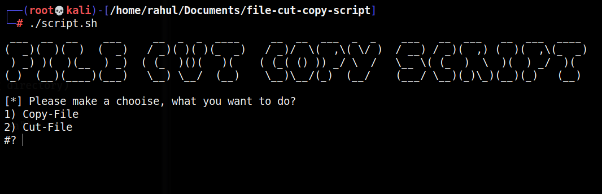
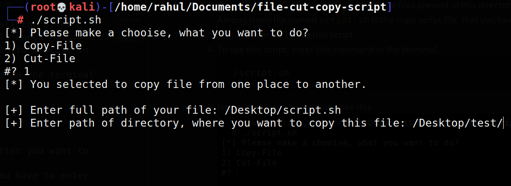

# File Cut Copy Script

### 📝 About project
This is a shell script, which can be used to automate the process of copying files and moving files from one place to another.

### 🧱 How to use
1. First you have to clone/download this repository, you can do that by executing this command in terminal.
    ```shell
    git clone https://github.com/rahulMishra05/File-cut-copy-script.git
    ```
2. Than change the working directory, and go to project directory.
    ```shell
    cd File-cut-copy-script
    ```
3. Now if you use `ls` command you will all the files present in this directory. Among them file named `script.sh` is the main script file, that you have to execute in order to use this script.
4. To use this script, enter this command in the terminal.
    ```shell
    ./script.sh
    ```
5. Now you will see an message like this 
    
    Here you have to choose that what action you want to perform.
6. Now when you enter your preference, you have to enter more details. Something like this will appear.
    
    