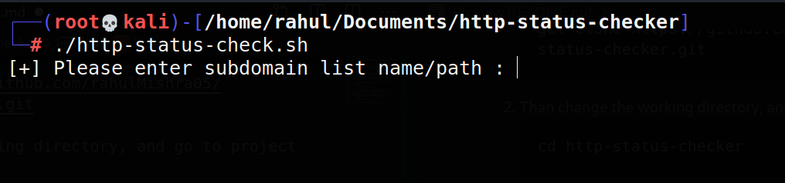

# HTTP(S) Status Checker
### 📝 About project
This is a shell/bash script, which can check the status code of the HTTP/HTTPS request and print it on the terminal.

This script needs a list of domains/subdomain, and when a user enter file name/path, it will start printing the status code of the requests, which were made to the domains/subdomains present inside the file.

### 🧱 How to use
1. First you have to clone/download this repository, you can do that by executing this command in terminal.
    ```shell
    git clone https://github.com/rahulMishra05/http-status-checker.git
    ```
2. Than change the working directory, and go to project directory.
    ```shell
    cd http-status-checker
    ```
3. Now if you use `ls` command you will all the files present in this directory. Among them file named `http-status-check.sh` is the main script file, that you have to execute in order to use this script.
4. To use this script, enter this command in the terminal.
    ```shell
    ./http-status-check.sh
    ```
5. Now you will see a message like this 
    
    - Here you have to enter the file name or file path which contains list of all domains/subdomains, whose HTTP/HTTPS request status you want to check.
6. Now it this tool will start displaying the status of all the domains/subdomains present in the list.
